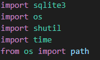
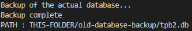
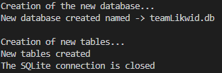
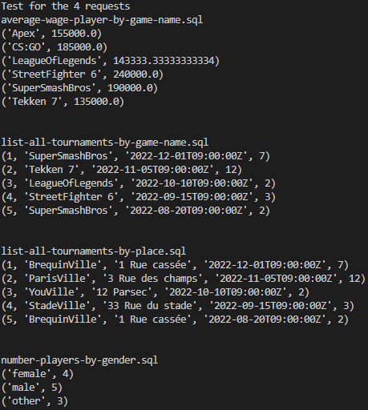

# Project_SQL

## About the project

* This project consists to migration of data from an old database, to a new, with another schema (from 'tpb2.db' to 'teamLikwid.db')
* The creation and the migration are in .sql files. Then it's Python script that execute SQL requests.

* The README is for Python, and the 'Rendu.pdf' is for SQL

## Installation

* From the command line: `git clone https://ytrack.learn.ynov.com/git/LSEILER/Project_SQL.git`

## Usage

* First you need to have python installed, with librairies:
    
    

* Then you just have to tap this command: `python migration.py`

## Steps of the second script

* The first step of the program is the backup of the old database, in case of problems. A new folder 'old-database-backup' will be created, containing the database file:

* Then the new file 'teamLikwid.db' is created (with Python : new connection. Create the file if not exists), with the new tables ('create-new-database.sql').
* And the migration of data is made ('migration.sql' file) with the new schema.

* The last step is the tests, which are on the sql-requests folder (the 4 requests of the client TeamLikwid). The Python script read all the .sql scripts in the folder and execute requests. You can add requests in the folder, he will be executed too.

## SQL scripts and new schema

* There is a file 'Rendu.pdf' that explain the steps and the reasoning to create the scripts for the new schema and the migration of data. 
